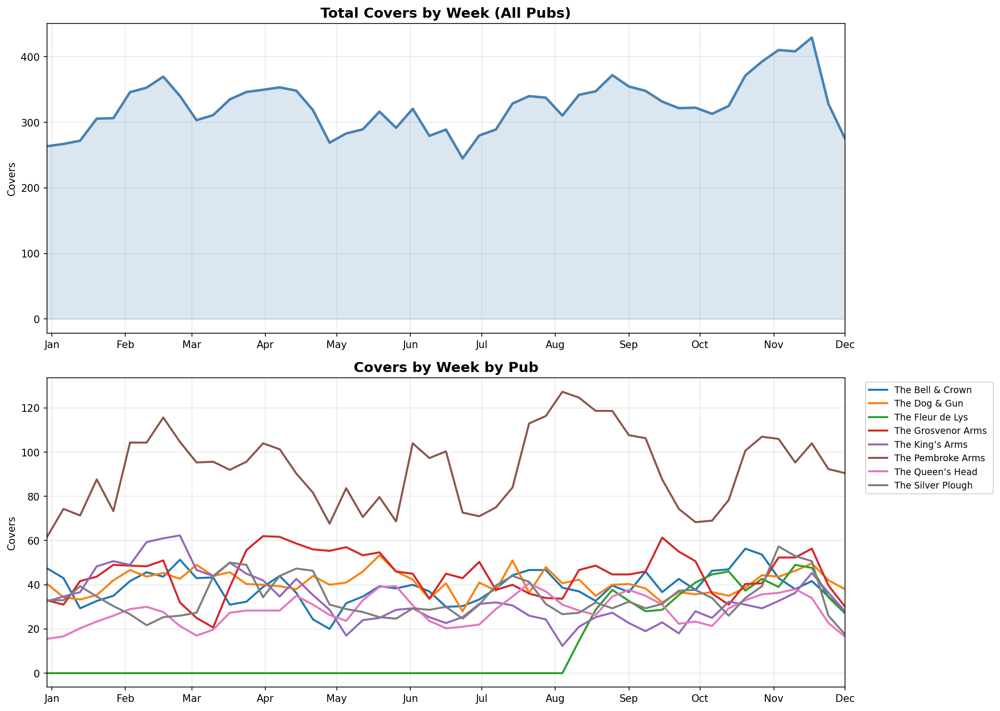

# Chickpea Pubs - Covers Analysis 2025

## Weekly Covers (Jan - Dec 2025)

**Data source:** SevenRooms API | **Period:** 1 Jan - 4 Dec 2025 | **Total covers:** 15,910

---

## Key Findings

### Overall Performance
- **Average weekly covers:** ~325 across all pubs
- **Peak weeks:** Late October / Early November (~440 covers)
- **Quietest period:** Mid-June (~210 covers)

### Seasonal Trends
| Season | Trend |
|--------|-------|
| Jan-Feb | Steady growth from 270 to 370 |
| Mar-May | Plateau around 320-350 |
| Jun-Jul | Summer dip to 250-280 |
| Aug-Nov | Strong recovery, peak at 440+ |
| Dec | Early signs of decline |

### Pub Performance

**Top performer:** The Pembroke Arms
- Consistently 100-130 covers/week
- 2-3x the volume of other pubs
- Peak in Aug-Sep (~130/week)

**Mid-tier (30-60 covers/week):**
- The Silver Plough
- The King's Arms
- The Bell & Crown
- The Grosvenor Arms
- The Dog & Gun
- The Queen's Head

**Low/No activity:**
- The Fleur de Lys (minimal SevenRooms bookings)

---

## Insights

1. **Summer requires marketing focus** - June-July shows consistent dip across all pubs
2. **Pembroke Arms carries the group** - Accounts for ~35% of total covers
3. **Q4 is strongest** - Oct-Nov peak suggests seasonal dining demand
4. **Growth trend** - Year showing overall upward trajectory (+50% from Jan to Nov peak)

---

## November 2025 - Bookings & Guest Feedback

### Overview

| Metric | Value |
|--------|-------|
| Total bookings | 4,063 |
| Total covers | 14,872 |
| Feedback responses | 361 |
| Average rating | **4.72/5** |
| 5-star reviews | 81% |
| Would recommend | 95% |

### Category Scores

| Category | Score |
|----------|-------|
| Ambience | 4.77/5 |
| Service | 4.72/5 |
| Drinks | 4.70/5 |
| Food | 4.63/5 |

**Food scores lowest** - consistent theme in comments around temperature, portion presentation, and value for money.

---

### Feedback by Pub

#### The King's Arms ⭐ Top Rated
**Rating: 4.88/5** | 43 responses | 91% 5-star

> *"Very good service from Izzie and delightful food and ambiance...why haven't we been before!"*

> *"Very friendly and helpful staff"*

Strong performance on service (4.82) and food (4.71). Minimal negative feedback.

---

#### The Silver Plough
**Rating: 4.74/5** | 61 responses | 82% 5-star | 340 bookings, 1,384 covers

> *"Everything here is first class. Friendly knowledgeable staff and the food is sublime."*

> *"Only very little things like the coffee being served in a mug not a cup..."*

Consistent performer. Minor feedback on presentation details.

---

#### The Fleur de Lys
**Rating: 4.74/5** | 73 responses | 81% 5-star | 626 bookings, 1,993 covers

> *"Great experience already booked again for next weekend!"*

**Areas to address:**
> *"We were a party of 11 people, we only ordered mains and waited way over an hour for our food"* (2/5)

> *"Food service could have been quicker. We waited over half an hour..."* (4/5)

**Theme:** Wait times for larger parties need attention.

---

#### The Queen's Head
**Rating: 4.72/5** | 43 responses | 86% 5-star | 296 bookings, 992 covers

> *"Food, service and ambience PERFECT. We will be back!"*

**Areas to address:**
> *"The 12.5% service charge is significant - although we had to go up and order ourselves"* (3/5)

**Theme:** Service charge perception when table service is limited.

---

#### The Bell & Crown
**Rating: 4.68/5** | 78 responses | 78% 5-star | 528 bookings, 1,805 covers

> *"Charming staff"*

**Areas to address:**
> *"The food was disappointing, for the price you would expect better presentation"* (3/5)

> *"Cornish bitter was cloudy we had to take back, new barrel much better"* (4/5)

**Theme:** Food presentation and drink quality consistency.

---

#### The Grosvenor Arms
**Rating: 4.63/5** | 63 responses | 75% 5-star

> *"Fantastic, genuine staff. Beautiful food and drinks. Warm and cosy atmosphere."*

> *"Amazing food, friendly and happy staff and beautiful cosy pub!"*

**Areas to address:**
> *"The quality for the price didn't meet expectations the beef was very very very rare"* (1/5)

> *"The food could have been hotter"* (4/5)

> *"Could do with a baby changing facility"* (5/5)

**Themes:** Food temperature/cooking, facilities for families, value perception.

---

### Key Themes from November Feedback

| Theme | Frequency | Impact |
|-------|-----------|--------|
| Wait times (large parties) | Medium | High |
| Food temperature | Medium | Medium |
| Value for money | Low | High |
| Staff friendliness | High (positive) | High |
| Ambience | High (positive) | Medium |

---

## Consistent Issues (2025 Full Year)

Based on analysis of 570 feedback responses, the following issues appear repeatedly across multiple guests and venues. These are not isolated incidents.

### 1. Wait Times for Food (13 complaints)

**Affected pubs:** Fleur de Lys, Bell & Crown, Queen's Head, Silver Plough, King's Arms

This is the most frequently cited issue, particularly for larger parties.

> *"We were a party of 11 people, we only ordered mains and waited way over an hour for food. Service was good but no one came to apologise for the wait."* — Fleur de Lys, 2/5

> *"We waited an hour for our food which was too long"* — King's Arms, 3/5

> *"Booked table for Sunday lunch. Order taken straight away but then waited nearly an hour"* — Queen's Head, 1/5

> *"Took too long to serve. Requested condiments arrived as meal was finishing."* — Bell & Crown, 2/5

**Pattern:** Issue is most acute at Fleur de Lys and Bell & Crown. Large party bookings (8+) are particularly affected.

---

### 2. Service Charge Perception (6 complaints)

**Affected pubs:** Bell & Crown, Queen's Head, Silver Plough

Guests question the 12.5% service charge when they perceive table service as limited.

> *"The 12.5% service charge is significant - although we had to go up and ask for condiments - there was no check in to see if everything was ok"* — Queen's Head, 3/5

> *"The service charge added to the bill... £25... was not appreciated. I would tip if I was happy with the service but not automatically"* — Silver Plough, 3/5

> *"Service charge disproportionate to service received"* — Bell & Crown, 2/5

**Pattern:** Issue arises when guests feel they had to self-serve (ordering at bar, fetching condiments) while still paying full service charge.

---

### 3. Food Temperature & Cooking (9 complaints)

**Affected pubs:** Silver Plough, Grosvenor Arms, Bell & Crown, Fleur de Lys

Mix of overcooking and dishes arriving lukewarm.

> *"The calves liver was overcooked today. That's a first for the Silver Plough"* — Silver Plough, 4/5

> *"Schnitzel overcooked and rather greasy"* — Silver Plough, 4/5

> *"The trout was ever so slightly overdone"* — Grosvenor Arms, 4/5

> *"Pie crust slightly burnt"* — Bell & Crown, 4/5

> *"The meat was supposed to be tender but not today"* — Silver Plough, 3/5

**Pattern:** Overcooking is more common than undercooking. Silver Plough has the most cooking consistency feedback.

---

### 4. Value for Money (6 complaints)

**Affected pubs:** Grosvenor Arms, Bell & Crown, Fleur de Lys

Guests feel quality doesn't always match price point.

> *"The quality for the price didn't meet expectations... expensive for 3 meals £100"* — Grosvenor Arms, 1/5

> *"For the price you would expect better presentation & garnish"* — Bell & Crown, 3/5

> *"Menu lacked some simpler dishes - everything is heavy or rich"* — Fleur de Lys, 3/5

**Pattern:** Often linked to other issues (wait times, cooking problems) which amplify the perception of poor value.

---

### 5. Portion Sizes & Presentation (6 complaints)

**Affected pubs:** Bell & Crown (most mentions)

> *"Portion sizes exceptionally small"* — Bell & Crown, 2/5

> *"We thought the portions for the starter and main courses were slightly small"* — Bell & Crown, 4/5

> *"For the price you would expect better presentation & garnish"* — Bell & Crown, 3/5

**Pattern:** Bell & Crown has the most portion size complaints. May need menu/plating review.

---

### Summary of Action Areas

| Issue | Frequency | Priority | Primary Venues |
|-------|-----------|----------|----------------|
| Wait times | 13 | **High** | Fleur de Lys, Bell & Crown |
| Service charge | 6 | Medium | Bell & Crown, Queen's Head |
| Food cooking | 9 | Medium | Silver Plough, Grosvenor Arms |
| Value perception | 6 | Medium | Grosvenor Arms, Bell & Crown |
| Portion sizes | 6 | Low | Bell & Crown |

### Recommendations

1. **Kitchen timing review** - Audit ticket times at Fleur de Lys and Bell & Crown, especially for parties 8+
2. **Service charge policy** - Consider removing or reducing when table service is limited, or improve communication
3. **Cooking consistency** - Refresher training on protein cooking temps at Silver Plough
4. **Bell & Crown review** - Multiple issues (wait times, portions, presentation) suggest broader operational review needed
5. **Family facilities** - Add baby changing at Grosvenor Arms (requested in positive feedback)

---

*Generated: December 2025*
